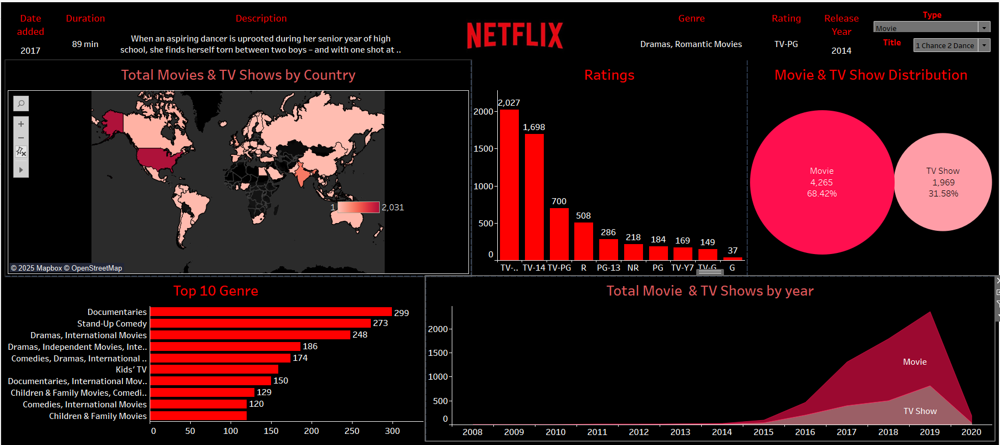

# 📺 Netflix Analysis Dashboard 🎬  

  

## 📌 Overview  
This project is a **Netflix Data Analysis Dashboard**, built using **Tableau (or any visualization tool you used)**.  
It provides insights into Netflix's content library, including **movies and TV shows**, ratings, genres, and country-wise distributions.  

## 🚀 Features  
🔹 **Total Movies & TV Shows by Country** 🌍  
🔹 **Ratings Distribution** 📊  
🔹 **Movie & TV Show Distribution** 🍿  
🔹 **Top 10 Genres** 🎭  
🔹 **Total Movies & TV Shows by Year** 📅  
🔹 **More visual insights into Netflix content trends**  

## 🛠️ Tech Stack  
- **Data Visualization:** Tableau / Power BI / Matplotlib / Seaborn  
- **Data Source:** Netflix Dataset (CSV, JSON, etc.)  
- **Programming (if used):** Python, Pandas, SQL  

## 📂 Dataset  
The dataset includes:  
- Movie & TV show details (Title, Release Year, Genre, etc.)  
- Ratings (TV-MA, TV-14, PG-13, etc.)  
- Country-wise content distribution  
- Year-wise additions  

## 📸 Screenshots  
  

## 📌 How to Use?  
1️⃣ Clone this repository:  
   ```bash
   git clone https://github.com/your-username/netflix-analysis.git
